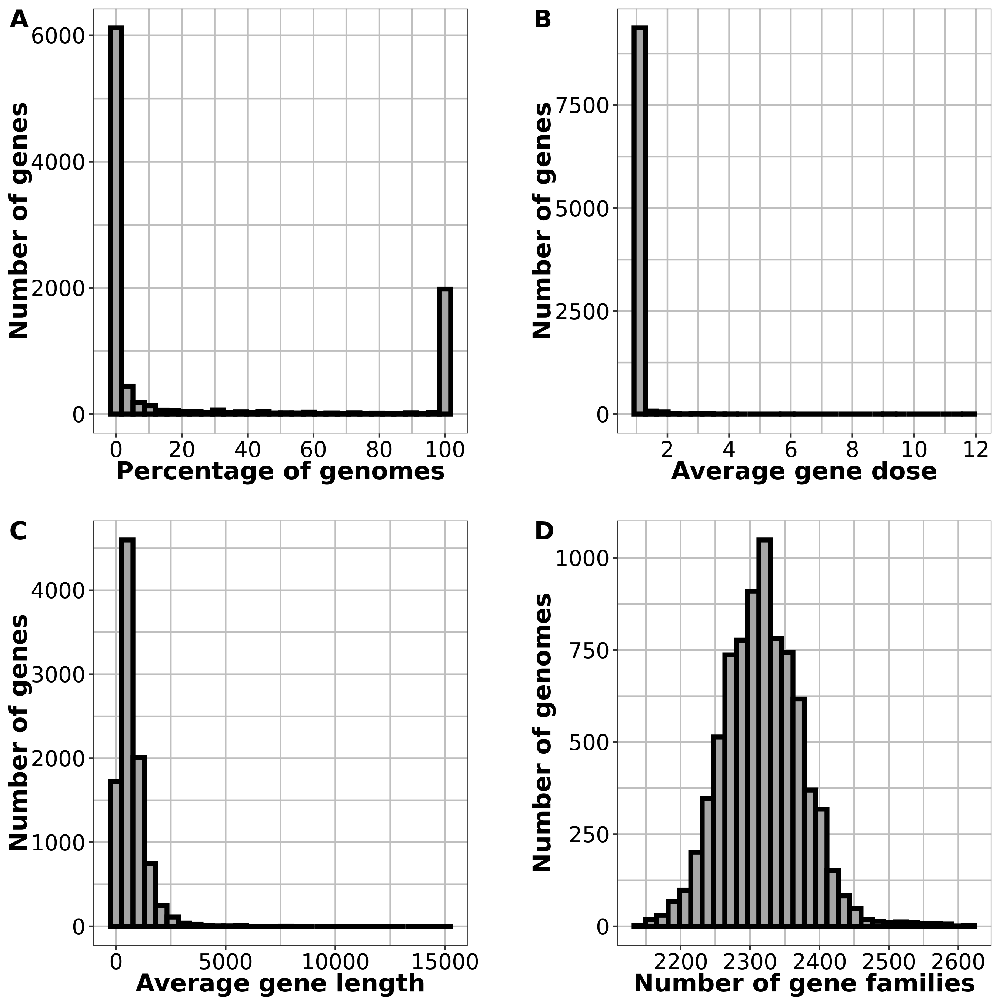

# SCAPE
SCAPE - StaphyloCoccus Aureus Pangenome Exploration

The following R markdown contains the code for generating figures from the manuscript "Average Nucleotide Identity based Staphylococcus aureus strain grouping allows identification of strain-specific genes in the pangenome" 

doi: [https://doi.org/10.1101/2024.01.29.577756](https://doi.org/10.1128/msystems.00143-24)

zenodo url: https://zenodo.org/records/10471309


# Download data from zenodo
```{r}

inborutils::download_zenodo(doi="10.5281/zenodo.10471309", path = "./", parallel = TRUE, quiet = FALSE)

```

# Loading libraries

```{r Loading libraries, message=FALSE, include=TRUE}

library(viridis)
library(scales)
library(cowplot)
library(ggplot2)
library(devtools)
library(MASS)
library(tidyverse)
library(ggtree)
library(ape)
library(ggnewscale)
library(RColorBrewer)
library(Rtsne)
library(data.table)
library(micropan)
library(randomcoloR)
library(janitor)

```

# Import tables 

## PIRATE tables

```{r PIRATE tables}

# Presence absence matrix
pirate_gene_presabs<-fread("PIRATE.gene_families.ordered_Rtab.tsv",header=T,sep="\t",nThread=6)
pirate_gene_presabs<-as.data.frame(pirate_gene_presabs)

# Gene families report
pirate_table<-fread("PIRATE.gene_families.ordered.tsv",header = T,sep="\t",select=c(1:22),nThread=6)
pirate_table<-as.data.frame(pirate_table)

# Random sample pirate
rand_presabs<-t(read.table("random_set_2000_PIRATE.gene_families.ordered_Rtab.tsv",header=T,sep="\t")) %>% row_to_names(row_number = 1)

```


## Reading final strain assignment table
```{r Strain assignment}

isolate_substrain<-fread("isolate_substrain_strain_freq_st_CC.tsv",header=T,sep="\t")
substrain_strain<-fread("substrain_strain_freq_ST_CC_AND.tsv",header=T,sep="\t")

```

## Merging with ANI table
```{r ANI}

ani_dists<-fread("fastani_output_reformatted.tab",sep="\t",header=F,col.names=c("substrain_1","substrain_2","ANI_inv"),select=c(1:3),nThread = 6)

ani_dists<-merge(ani_dists,substrain_strain,by.x="substrain_1",by.y="substrain")
ani_dists<-merge(ani_dists,substrain_strain,by.x="substrain_2",by.y="substrain")

ani_dists$strain_concordance<-ifelse(ani_dists$strain_representative.x==ani_dists$strain_representative.y,"same strain cluster","different strain cluster")

ani_dists$cc_concordance<-ifelse(ani_dists$pubmlst_cc.x==ani_dists$pubmlst_cc.y,"same cc","different cc")

agr<-read.table("pangenome_substrains_agrvate_summary.tab",header=T,sep="\t")

ani_dists<-merge(ani_dists,agr[,c(1,2)],by.x="substrain_1",by.y="substrain")
ani_dists<-merge(ani_dists,agr[,c(1,2)],by.x="substrain_2",by.y="substrain")
ani_dists$agr_concordance<-ifelse(ani_dists$agr_group.x==ani_dists$agr_group.y,"same agr","different agr")

```

## Minor allele frequency table
```{r MAF}
staphopiaV2_MAFs<-read.table("staphopia_v2_saureus_goldsilver_MAFs.txt",header=F,sep="\t",col.names=c("minorAF_sum","total_variants","acc"))
```

# FIG 1: Sankey diagram showing workflow
```{text Sankey}

This figure was created using https://sankeymatic.com/ with the following text

// Enter Flows between Nodes, like this:
//         Source [AMOUNT] Target

Staphopia [72716] Gold & Silver #8cabc2
Staphopia [10667] Bronze & Exclude #aaaaaa

Gold & Silver [57301] S. aureus #8cabc2
Gold & Silver [15415] Non S. aureus #aaaaaa

S. aureus [56771] Pure samples #8cabc2
S. aureus [530] Mixed samples

Pure samples [7954] Cluster representatives #ff8c8c
Pure samples [50080] Collapsed genomes

Complete genomes [1263] Filtered Complete genomes #8cabc2
Complete genomes [212] Complete genomes with 'N' #aaaaaa

Filtered Complete genomes [1263] Pure samples #8cabc2

// Node colors:
:Staphopia #000000
:Gold & Silver #000000
:S. aureus #000000
:Pure samples #000000
:Cluster representatives #FF0000
:Complete genomes #000000
:Filtered Complete genomes #000000

:Bronze & Exclude #888888
:Non S. aureus #888888
:Mixed samples #888888
:Collapsed genomes #888888
:Complete genomes with 'N' #888888

```
<!-- -->

# FIG S1: Plots for pangenome 

## FIG S1A: Plotting MAF filtering

```{r FigS1A warning=FALSE}

FigS1A<-ggplot(data=staphopiaV2_MAFs)+
  geom_point(aes(x=total_variants,y=minorAF_sum/total_variants),size=1)+
  theme_bw()+
  ylim(0,1)+
  scale_x_continuous(breaks=pretty_breaks(n=10))+
  theme(axis.text.x=element_text(size=12,color="black",angle=45,hjust=1))+
  theme(axis.text.y=element_text(size=12,color="black"))+
  theme(axis.title=element_text(size=14,color="black",face="bold"))+
  geom_hline(yintercept = 0.05,color="red",size=0.75)+
  xlim(0,150000)+
  labs(x="Number of variant positions",y="Average MAF")+
  theme(legend.position = "none")

```

## FIG S1B: Plotting within cluster ANI spread

```{r FigS1B warnings=F}

FigS1B<-ggplot(data=substrain_strain[substrain_strain$cluster_frequency>5,],aes(x=reorder(as.factor(strain),-substrain_AND),y=100-(substrain_AND*100)))+
  geom_boxplot()+
  theme_bw(base_family = "Arial")+
  theme(axis.text.y = element_text(size=14,color="black"))+
  theme(axis.text.x = element_text(size=6,color="black",angle=90,vjust=0.5))+
  theme(axis.title = element_text(size=16,color="black",face="bold"))+
  scale_y_continuous(breaks=pretty_breaks(n=6))+
  labs(x="Strain cluster number",y="ANI")


```

## FIG S1C: Gene discovery

```{r FigS1C}

set.seed(1000)

gene_presabs_t<-transpose(pirate_gene_presabs)
gene_presabs_t<-gene_presabs_t %>% row_to_names(row_number = 1)
gene_presabs_t[] <- lapply(gene_presabs_t, as.numeric)
gene_presabs_t<-as.data.frame(gene_presabs_t)

iter<-seq(1,5) # Number of iterations, set to 5 in manuscript
no_genomes<-seq(1,1000) # Number of genomes sampled, set to 1000 in manuscript

df <- data.frame(no_of_genomes=numeric(),no_new_genes=numeric(),iteration=numeric(),total_genes=numeric())

for (x in iter) {
  
l<-c()
c<-c()
g<-c()

r<-slice_sample(gene_presabs_t,n=1)


for (i in no_genomes) {

r<-slice_sample(gene_presabs_t,n=i,replace=F)
c<-colnames(r[,(colSums(r)>0)])
l<-length(setdiff(c,g))
g<-length(colnames(r[,(colSums(r)>0)]))

df[nrow(df) + 1,] = c(i, l, x,g)

}
}

unboundedness_1<-df

median_df <- unboundedness_1 %>% group_by(no_of_genomes) %>% summarise(median_pts=median(total_genes))

##Random set pirate

rand_presabs<-as.data.frame(rand_presabs)
rand_presabs[] <- lapply(rand_presabs, as.numeric)

iter<-seq(1,5)
no_genomes<-seq(1,1000)

df <- data.frame(no_of_genomes=numeric(),no_new_genes=numeric(),iteration=numeric(),total_genes=numeric())

for (x in iter) {
  
l<-c()
c<-c()
g<-c()

r<-slice_sample(rand_presabs,n=1)


for (i in no_genomes) {
  
r<-slice_sample(rand_presabs,n=i,replace = F)
c<-colnames(r[,(colSums(r)>0)])
l<-length(setdiff(c,g))
g<-length(colnames(r[,(colSums(r)>0)]))

df[nrow(df) + 1,] = c(i, l, x, g)

}
}

rand_unboundedness<-df

median_df_rand <- rand_unboundedness %>% group_by(no_of_genomes) %>% summarise(median_pts=median(total_genes))

### COMBINED PLOT
FigS1C<-ggplot(data=NULL)+
  geom_point(data=unboundedness_1,aes(x=no_of_genomes,y=total_genes),shape=22,color="lightpink",fill="lightpink",alpha=0.5,size=1)+
  geom_point(data=median_df,aes(x=no_of_genomes,y=median_pts),shape=22,color="red",fill="red",size=1)+
  geom_point(data=rand_unboundedness,aes(x=no_of_genomes,y=total_genes),shape=22,color="lightblue",fill="lightblue",alpha=0.5,size=1)+
  geom_point(data=median_df_rand,aes(x=no_of_genomes,y=median_pts),shape=22,color="blue",fill="blue",size=1)+
  theme_bw()+
  theme(axis.title=element_text(face="bold",color="black",size=14))+
  theme(axis.text.x=element_text(color="black",size=14,angle=45,hjust=1))+
  theme(axis.text.y=element_text(color="black",size=14))+
  theme(panel.grid.major = element_line(color="grey60"))+
  theme(panel.grid.minor = element_line(color="grey70"))+
  labs(x="Number of genomes",y="Total number of genes")

```


## FIG S1D: Lineage discovery

```{r FigS1D}

set.seed(1000)

iter<-seq(1,5) # Number of iterations, set to 5 in manuscript
no_genomes<-seq(1,1000) # Number of genomes sampled, set to 1000 in manuscript

df <- data.frame(no_of_genomes=numeric(),no_new_lineages=numeric(),iteration=numeric(),total_lineages=numeric())

for (x in iter) {
  
l<-c()
c<-c()
g<-c()

r<-slice_sample(substrain_strain,n=1)

for (i in no_genomes) {

r<-slice_sample(substrain_strain,n=i,replace = F)
c<-r$strain_representative
l<-length(setdiff(c,g))
g<-length(unique(r$strain_representative))

df[nrow(df) + 1,] = c(i, l, x,g)

}
}

lineage_df<-df

median_df_lin <- lineage_df %>% group_by(no_of_genomes) %>% summarise(median_pts=median(total_lineages))

### RAND LINEAGE DISCOVERY

ID_clusterrep<-isolate_substrain[,c(1,3)]

df <- data.frame(no_of_genomes=numeric(),no_new_lineages=numeric(),iteration=numeric(),total_lineages=numeric())

for (x in iter) {
  
l<-c()
c<-c()
g<-c()

r<-slice_sample(ID_clusterrep,n=1)

for (i in no_genomes) {

r<-slice_sample(ID_clusterrep,n=i,replace = F)
c<-r$strain_representative
l<-length(setdiff(c,g))
g<-length(unique(r$strain_representative))

df[nrow(df) + 1,] = c(i, l, x,g)

}
}

lineage_df_rand<-df

median_df_lin_rand <- lineage_df_rand %>% group_by(no_of_genomes) %>% summarise(median_pts=median(total_lineages))


#COMBINED PLOT
FigS1D<-ggplot(data=NULL)+
  geom_point(data=lineage_df,aes(x=no_of_genomes,y=total_lineages),shape=22,color="lightpink",fill="lightpink",alpha=0.5,size=1)+
geom_point(data=median_df_lin,aes(x=no_of_genomes,y=median_pts),shape=22,color="red",fill="red",size=1)+
  #geom_smooth(data=lineage_df,color="red",se=F,aes(x=no_of_genomes,y=total_lineages))+
  geom_point(data=lineage_df_rand,aes(x=no_of_genomes,y=total_lineages),shape=22,color="lightblue",fill="lightblue",alpha=0.5,size=1)+
  #geom_smooth(data=lineage_df_rand,color="blue",se=F,aes(x=no_of_genomes,y=total_lineages))+
  geom_point(data=median_df_lin_rand,aes(x=no_of_genomes,y=median_pts),shape=22,color="blue",fill="blue",size=1)+
  theme_bw()+
  theme(axis.title=element_text(face="bold",color="black",size=14))+
  theme(axis.text.x=element_text(color="black",size=14,angle=45,hjust=1))+
  theme(axis.text.y=element_text(color="black",size=14))+
  theme(panel.grid.major = element_line(color="grey60"))+
  theme(panel.grid.minor = element_line(color="grey70"))+
  labs(x="Number of genomes",y="Total number of strains")

```

## FIG S1: Combined

```{r FigS1 warning=FALSE}
FigS1<-plot_grid(plot_grid(FigS1A,NULL,FigS1B,nrow=1,rel_widths = c(1,0.1,1),labels=c("A","","B"),label_size = 16),NULL,plot_grid(FigS1C,NULL,FigS1D,nrow=1,rel_widths = c(1,0.1,1),labels=c("C","","D"),label_size = 16),nrow=3,ncol=1,rel_heights=c(1,0.05,1))
```

<!-- -->

# FIG S2: Plotting basic info

## FIG S2A: Plot frequency of gene presence absence
```{r FigS2A}

FigS2A<-ggplot(data=pirate_table,aes(x=(number_genomes*100/7954)))+
  geom_histogram(color="black",fill="grey65",size=1.5)+
  scale_x_continuous(breaks=pretty_breaks(n=6))+
  theme_bw(base_family = "Arial")+
  theme(axis.text = element_text(size=14,color="black"))+
  theme(axis.title = element_text(size=16,color="black",face="bold"))+
  theme(panel.grid.major = element_line(color="grey75",size=0.5))+
  theme(panel.grid.minor = element_line(color="grey75",size=0.5))+
  labs(x="Percentage of genomes",y="Number of genes")
```

## FIG S2B: Plot average gene dosage

```{r FigS2B}
FigS2B<-ggplot(data=pirate_table,aes(x=(average_dose)))+
  geom_histogram(color="black",fill="grey65",size=1.5)+
  scale_x_continuous(breaks=pretty_breaks(n=6))+
  theme_bw(base_family = "Arial")+
  theme(axis.text = element_text(size=14,color="black"))+
  theme(axis.title = element_text(size=16,color="black",face="bold"))+
  theme(panel.grid.major = element_line(color="grey75",size=0.5))+
  theme(panel.grid.minor = element_line(color="grey75",size=0.5))+
  labs(x="Average gene dose",y="Number of genes")
```

## FIG S2C: Plot average gene length

```{r FigS2C}
FigS2C<-ggplot(data=pirate_table,aes(x=(`average_length(bp)`)))+
  geom_histogram(color="black",fill="grey65",size=1.5)+
  scale_x_continuous(breaks=pretty_breaks(n=6))+
  theme_bw(base_family = "Arial")+
  theme(axis.text = element_text(size=14,color="black"))+
  theme(axis.title = element_text(size=16,color="black",face="bold"))+
  theme(panel.grid.major = element_line(color="grey75",size=0.5))+
  theme(panel.grid.minor = element_line(color="grey75",size=0.5))+
  labs(x="Average gene length",y="Number of genes")
```

## FIG S2D: Plot number of gene families

```{r FigS2D}
FigS2D<-ggplot(data=(as.data.frame(colSums(pirate_gene_presabs[,(2:7955)]))),aes(x=`colSums(pirate_gene_presabs[, (2:7955)])`))+
  geom_histogram(color="black",fill="grey65",size=1.5)+
  scale_x_continuous(breaks=pretty_breaks(n=6))+
  theme_bw(base_family = "Arial")+
  theme(axis.text = element_text(size=14,color="black"))+
  theme(axis.title = element_text(size=16,color="black",face="bold"))+
  theme(panel.grid.major = element_line(color="grey75",size=0.5))+
  theme(panel.grid.minor = element_line(color="grey75",size=0.5))+
  labs(x="Number of gene families",y="Number of genomes")
```

## FIG S2: Combined

```{r FigS2 warning=FALSE}
FigS2<-plot_grid(plot_grid(FigS2A,NULL,FigS2B,nrow=1,rel_widths = c(1,0.1,1),labels=c("A","","B"),label_size = 16),NULL,plot_grid(FigS2C,NULL,FigS2D,nrow=1,rel_widths = c(1,0.1,1),labels=c("C","","D"),label_size = 16),nrow=3,ncol=1,rel_heights=c(1,0.05,1))
```

<!-- -->

# FIG 2: Plotting concordance with ANI

```{r Fig2 warning=FALSE}

Fig2A<-ggplot(data = ani_dists,aes(x=ANI_inv,fill=strain_concordance))+
  geom_histogram(size=1,bins=100)+
  scale_x_continuous(breaks=pretty_breaks(n=4))+
  scale_y_continuous(labels = function(x) format(x, scientific = TRUE),breaks=pretty_breaks(n=4))+
  scale_fill_manual("Strain concordance",values=c("grey65","tomato3"),labels=c("Different strain","Same strain"))+
  theme_bw(base_family = "Arial")+
  theme(axis.text = element_text(size=14,color="black"))+
  theme(axis.title = element_text(size=16,color="black",face="bold"))+
  theme(panel.grid.major = element_line(color="grey75",size=0.5))+
  theme(panel.grid.minor = element_line(color="grey75",size=0.5))+
  theme(legend.position = "right")+
  theme(legend.text=element_text(size=14),legend.title = element_text(size=14,face="bold"))+
  labs(x="AN distance (1 - ANI)",y="Number of\ngenomes")+
  geom_vline(xintercept = 0.005,color="red")

Fig2B<-ggplot(data = ani_dists[!is.na(ani_dists$cc_concordance),],aes(x=ANI_inv,fill=cc_concordance))+
  geom_histogram(size=1,bins=100)+
  scale_x_continuous(breaks=pretty_breaks(n=4))+
  scale_y_continuous(labels = function(x) format(x, scientific = TRUE),breaks=pretty_breaks(n=4))+
  scale_fill_manual("CC concordance",values=c("grey65","tomato3"),labels=c("Different CC","Same CC"))+
  theme_bw(base_family = "Arial")+
  theme(axis.text = element_text(size=14,color="black"))+
  theme(axis.title = element_text(size=16,color="black",face="bold"))+
  theme(panel.grid.major = element_line(color="grey75",size=0.5))+
  theme(panel.grid.minor = element_line(color="grey75",size=0.5))+
  theme(legend.position = "right")+
  theme(legend.text=element_text(size=14),legend.title = element_text(size=14,face="bold"))+
  labs(x="AN distance (1 - ANI)",y="Number of\ngenomes")+
  geom_vline(xintercept = 0.005,color="red")

Fig2C<-ggplot(data = ani_dists[ani_dists$pubmlst_cc.x=="CC1" & ani_dists$pubmlst_cc.y=="CC1",],aes(x=ANI_inv,fill=strain_concordance))+
  geom_histogram(size=1,bins=100)+
  scale_x_continuous(breaks=pretty_breaks(n=4))+
  scale_y_continuous(labels = function(x) format(x, scientific = TRUE),breaks=pretty_breaks(n=4))+
  scale_fill_manual("Strain concordance",values=c("grey65","tomato3"),labels=c("Different strain","Same strain"))+
  theme_bw(base_family = "Arial")+
  theme(axis.text = element_text(size=14,color="black"))+
  theme(axis.title = element_text(size=16,color="black",face="bold"))+
  theme(panel.grid.major = element_line(color="grey75",size=0.5))+
  theme(panel.grid.minor = element_line(color="grey75",size=0.5))+
  theme(legend.position = "right")+
  theme(legend.text=element_text(size=14),legend.title = element_text(size=14,face="bold"))+
  labs(x="AN distance (1 - ANI)",y="Number of\nCC1 genomes")+
  geom_vline(xintercept = 0.005,color="red")

Fig2D<-ggplot(data = ani_dists,aes(x=ANI_inv,fill=agr_concordance))+
  geom_histogram(size=1,bins=100)+
  scale_x_continuous(breaks=pretty_breaks(n=4))+
  scale_y_continuous(labels = function(x) format(x, scientific = TRUE),breaks=pretty_breaks(n=4))+
  scale_fill_manual("agr concordance",values=c("grey65","tomato3"),labels=c("Different agr","Same agr"))+
  theme_bw(base_family = "Arial")+
  theme(axis.text = element_text(size=14,color="black"))+
  theme(axis.title = element_text(size=16,color="black",face="bold"))+
  theme(panel.grid.major = element_line(color="grey75",size=0.5))+
  theme(panel.grid.minor = element_line(color="grey75",size=0.5))+
  theme(legend.position = "right")+
  theme(legend.text=element_text(size=14),legend.title = element_text(size=14,face="bold"))+
  labs(x="AN distance (1 - ANI)",y="Number of\ngenomes")+
  geom_vline(xintercept = 0.005,color="red")

Fig2<-plot_grid(plot_grid(Fig2A,NULL,Fig2B,nrow=1,ncol=3,rel_widths=c(1,0.1,1),labels=c("A","","B")),NULL,plot_grid(Fig2C,NULL,Fig2D,nrow=1,ncol=3,rel_widths = c(1,0.05,1,1,0.1,1),labels=c("C","","D")),ncol=1,nrow=3,rel_heights = c(1,0.1,1))+
  coord_cartesian(expand = 0.1)


```

<!-- -->


# FIG 3: F(ST) Calculation

```{r Fig3}

library(tidyverse)
library(readr)
library(ggside)
set.seed(1000)

genes<-pirate_gene_presabs

gene_fam_ids <- genes$Gene

future_rownames <- colnames(genes[,2:ncol(genes)])

sts_new<-as.data.frame(substrain_strain[,c(1,2,4)])
sts_new$substrain <- gsub('\\.', '_', sts_new$substrain)
rownames(sts_new)<-sts_new$substrain

sts_new <- sts_new[rownames(sts_new) %in% future_rownames ,]

genes <- as.data.frame(t(genes))

header.true <- function(df) {
  names(df) <- as.character(unlist(df[1,]))
  df[-1,]
}
genes<-header.true(genes)
genes[1:ncol(genes)]<-sapply(genes[1:ncol(genes)],as.numeric)

#percent present in entire set. 
percent_present <- sapply(genes,mean)


sts_new<- sts_new[order(future_rownames), ]
rownames(genes) <- future_rownames

#This adds all the info of st,cc, snp 
genes <- merge(genes, sts_new, by = 'row.names', all = F)
rownames(genes) <- genes$Row.names
genes$Row.names <- NULL

#Get rid of the columns where all values are the same. There is no info in these columns 
genes <- genes %>% select(where(~n_distinct(.) > 1))


# Filter to include only top 46 clusters (only clusters with more than 10 genomes)
STs_look_at <- names(sort(table(genes$strain_representative), decreasing = T)[1:46])
genes_st_reduced <- filter(genes, strain_representative %in% STs_look_at)

#fst function where put in dataframe and st. MAKE SURE TO ONLY PUT COLUMNS WITH GENES, YOU MIGHT NEED TO SELECT ONLY CERTAINS COLUMNS.
fst_function <- function(df, st){
  
  centers<-aggregate(df,by=list(st), mean) 
  centers$st <- NULL
  centers$Group.1 <- NULL
  colnames(centers)[colnames(centers) == 'Group.1'] <- 'ST'
  
  all_center <-  sapply(df, mean)
  rownames(centers)  <- centers$Group.1
  
  
  st_prop <- prop.table(table(st))
  fst_list <- vector(mode= "numeric", length=0)
  for(i in 1:length(centers)) {
    c_stat <- 0 
    for(j in 1:length(st_prop)){
      c_stat <- c_stat + (st_prop[[j]]*centers[j,i]*(1-centers[j,i]))
    }
    fst_list <- append(fst_list, (all_center[i]*(1-all_center[i]) - c_stat)/(all_center[i]*(1-all_center[i])))
  }
  return(fst_list)
}

fst_int_genes<-as.data.frame(fst_function(genes_st_reduced,genes_st_reduced$strain_representative))
fst_int_genes$Gene<-rownames(fst_int_genes)
colnames(fst_int_genes)<-c("fst","Gene")

fst_int_genes<-merge(fst_int_genes,as.data.frame(percent_present),by="row.names",all.x=T)

fst_int_genes<-fst_int_genes[!is.na(fst_int_genes$percent_present),]
fst_int_genes$fst[is.na(fst_int_genes$fst)] <- 0

fst_int_genes<-(fst_int_genes[order(-fst_int_genes$percent_present),])

Fig3A<-ggplot(data=fst_int_genes[fst_int_genes$percent_present>0.1 & fst_int_genes$percent_present<0.95,],aes(y=fst,x=percent_present*100))+
  geom_point(color="black",shape=21,size=3)+
  theme_bw()+
  theme(axis.text=element_text(size=16,color="black"))+
  theme(axis.title=element_text(size=16,color="black",face="bold"))+
  scale_x_continuous(breaks=pretty_breaks(n=6))+
  xlab("Percentage present")+
  ylab(bquote(bold(F[ST])))+
  geom_xsidehistogram(position="stack",fill="grey65",color="black") +
  geom_ysidehistogram(position="stack",fill="grey65",color="black") +
  scale_xsidey_continuous(breaks=pretty_breaks(n=2))+
  scale_ysidex_continuous(breaks=pretty_breaks(n=2))+
  theme(ggside.panel.scale = .25)+
  theme(legend.position = "none")+
  ylim(-0.1,1)


# RANDOMIZED FST CALC 


set.seed(1000)
#Randomly assign strain representatives to all genomes and then use the fst function
rand_fst_int_genes<-as.data.frame(fst_function(genes_st_reduced,transform(genes_st_reduced,strain_representative=sample(strain_representative))$strain_representative))
rand_fst_int_genes$Gene<-rownames(rand_fst_int_genes)
colnames(rand_fst_int_genes)<-c("fst","Gene")

rand_fst_int_genes<-merge(rand_fst_int_genes,as.data.frame(percent_present),by="row.names",all.x=T)

rand_fst_int_genes<-rand_fst_int_genes[!is.na(rand_fst_int_genes$percent_present),]
rand_fst_int_genes$fst[is.na(rand_fst_int_genes$fst)] <- 0

rand_fst_int_genes<-(rand_fst_int_genes[order(-rand_fst_int_genes$percent_present),])

rand_fst_int_genes<-merge(rand_fst_int_genes[,c(2,3,4)],pirate_table[,c(1,2,3,4)],by.x="Gene",by.y="allele_name")

Fig3B<-ggplot(data=rand_fst_int_genes[rand_fst_int_genes$percent_present>0.1 & rand_fst_int_genes$percent_present<0.95,],aes(y=fst,x=percent_present*100))+
  geom_point(color="black",shape=21,size=3)+
  theme_bw()+
  theme(axis.text=element_text(size=16,color="black"))+
  theme(axis.title=element_text(size=16,color="black",face="bold"))+
  scale_x_continuous(breaks=pretty_breaks(n=6))+
  xlab("Percentage present")+
  ylab(bquote(bold(F[ST])))+
  geom_xsidehistogram(position="stack",fill="grey65",color="black") +
  geom_ysidehistogram(position="stack",fill="grey65",color="black") +
  scale_xsidey_continuous(breaks=pretty_breaks(n=2))+
  scale_ysidex_continuous(breaks=pretty_breaks(n=2))+
  theme(ggside.panel.scale = .25)+
  ylab("")+
  ylim(-0.1,1)


Fig3<-plot_grid(Fig3A,NULL,Fig3B,nrow=1,rel_widths = c(1,0.1,1),labels=c("A","","B"),label_size = 16)

```

<!-- -->

# FIG S3: F(ST) with agr groups and 740 set

## FIG S3A: F(ST) for 7954 set with agr
```{r FigS3A}

genes<-pirate_gene_presabs

gene_fam_ids <- genes$Gene

future_rownames <- colnames(genes[,2:ncol(genes)])

sts_new<-as.data.frame(agr[,c(1,2)])

sts_new$substrain <- gsub('\\.', '_', sts_new$substrain)
rownames(sts_new)<-sts_new$substrain

sts_new <- sts_new[rownames(sts_new) %in% future_rownames ,]

genes <- as.data.frame(t(genes))

header.true <- function(df) {
  names(df) <- as.character(unlist(df[1,]))
  df[-1,]
}
genes<-header.true(genes)
genes[1:ncol(genes)]<-sapply(genes[1:ncol(genes)],as.numeric)

#percent present in entire set. 
percent_present <- sapply(genes,mean)


sts_new<- sts_new[order(future_rownames), ]
rownames(genes) <- future_rownames

#This adds agr info to genes 
genes <- merge(genes, sts_new, by = 'row.names', all = F)
rownames(genes) <- genes$Row.names
genes$Row.names <- NULL

#Get rid of the columns where all values are the same. There is no info in these columns 
genes <- genes %>% select(where(~n_distinct(.) > 1))


# Filter to include only known agr (samples with unknown agr groups filtered out)
STs_look_at <- names(sort(table(genes$agr_group), decreasing = T)[1:4])
genes_st_reduced <- filter(genes, agr_group %in% STs_look_at)

fst_agr<-as.data.frame(fst_function(genes_st_reduced,genes_st_reduced$agr_group))
fst_agr$Gene<-rownames(fst_agr)
colnames(fst_agr)<-c("fst","Gene")

fst_agr<-merge(fst_agr,as.data.frame(percent_present),by="row.names",all.x=T)

fst_agr<-fst_agr[!is.na(fst_agr$percent_present),]

fst_agr<-(fst_agr[order(-fst_agr$percent_present),])

fst_agr<-merge(fst_agr[,c(2,3,4)],pirate_table[,c(1,2,3,4)],by.x="Gene",by.y="allele_name")

FigS3A<-ggplot(data=fst_agr[fst_agr$percent_present>0.1 & fst_agr$percent_present<0.95,],aes(y=fst,x=percent_present*100))+
  geom_point(color="black",shape=21,size=3)+
  theme_bw()+
  theme(axis.text=element_text(size=16,color="black"))+
  theme(axis.title=element_text(size=16,color="black",face="bold"))+
  xlab("Percentage present")+
  ylab(bquote(bold(F[ST])))+
  geom_xsidehistogram(position="stack",color="black",fill="grey75") +
  geom_ysidehistogram(position="stack",color="black",fill="grey75") +
  scale_xsidey_continuous(breaks=pretty_breaks(n=2))+
  scale_ysidex_continuous(breaks=pretty_breaks(n=2))+
  theme(ggside.panel.scale = .25)

```

## FIG S3B: F(ST) for 740 set with strains
```{r FigS3B}

# F(ST) was calculated with the pirate presence absence table identical to Fig 3, just replace the 7954 pirate table with the 740. 

fst_740<-read.table("timsfigsData/strain-740-fst.tab",header=T,sep="\t")

FigS3B<-ggplot(data=fst_740[fst_740$percent_present>0.1 & fst_740$percent_present<0.95,],aes(y=fst,x=percent_present*100))+
  geom_point(color="black",shape=21,size=3)+
  theme_bw()+
  theme(axis.text=element_text(size=16,color="black"))+
  theme(axis.title=element_text(size=16,color="black",face="bold"))+
  xlab("Percentage present")+
  ylab(bquote(bold(F[ST])))+
  geom_xsidehistogram(position="stack",color="black",fill="grey75") +
  geom_ysidehistogram(position="stack",color="black",fill="grey75") +
  scale_xsidey_continuous(breaks=pretty_breaks(n=2))+
  scale_ysidex_continuous(breaks=pretty_breaks(n=2))+
  theme(ggside.panel.scale = .25)

FigS3<-plot_grid(FigS3A,NULL,FigS3B,nrow=1,rel_widths = c(1,0.1,1),labels=c("A","","B"),label_size = 16)

```

<!-- -->

# FIG 4: Phylogeny

```{r Fig4}

# Read input files
tree<-read.tree("core_aln_snp_sites_fasttree.tree")
tree<-root(tree,"GCA_000144955_2_ASM14495v2")

subs<-substrain_strain[,c(1,2,3)]
subs$substrain <- gsub('\\.', '_', subs$substrain)

pirate_gene_presabs_fst <- as.data.frame(t(pirate_gene_presabs))
header.true <- function(df) {
  names(df) <- as.character(unlist(df[1,]))
  df[-1,]
}
pirate_gene_presabs_fst <-header.true(pirate_gene_presabs_fst)

pirate_gene_presabs_fst$substrain<-rownames(pirate_gene_presabs_fst)
pirate_gene_presabs_fst<-merge(subs,pirate_gene_presabs_fst,by="substrain")

fst_int_genes_f<-fst_int_genes$Gene[fst_int_genes$percent_present>.10 & fst_int_genes$percent_present<.95]

pirate_gene_presabs_fst<-as.data.frame(pirate_gene_presabs_fst)
pirate_gene_presabs_fst<-pirate_gene_presabs_fst[,c("substrain","strain_representative",fst_int_genes_f)]

#Convert all "1" in the presence absence matrix into the corresponding fst value for that gene
for (i in fst_int_genes_f) {
pirate_gene_presabs_fst[i][pirate_gene_presabs_fst[i]==1]<-fst_int_genes$fst[fst_int_genes$Gene==i]
}

rownames(pirate_gene_presabs_fst)<-pirate_gene_presabs_fst$substrain

pirate_gene_presabs_fst[, c(3:733)] <- sapply(pirate_gene_presabs_fst[, c(3:733)], as.numeric)


# Hand picked gene family IDs to show fst. Change accordingly. 
genes_of_interest<-c("g00597_1_00007","g00220_1_00018","g00098_3_00032","g00187_3_00029","g00270_2_00009","g00270_3_00003","g00187_4_00002","g01879_00005","g00582_1_00001","g00220_2_00008")

pirate_gene_presabs_fst_select<-pirate_gene_presabs_fst[,genes_of_interest]

colnames(pirate_gene_presabs_fst_select)<-c("SEG","SEU","SSL8","LukE","LukD","LukF","LukS","TSST","SEA","SEB")

# Add dummy column gap for separating high fst and low fst
pirate_gene_presabs_fst_select<-add_column(pirate_gene_presabs_fst_select, dummy = 0, .after = 5)
colnames(pirate_gene_presabs_fst_select)[6] <-" "

# Plot tree with strain cluster annotation
set.seed(19942812);t<-ggtree(tree,layout = "rectangular",size=0.6,color="black") %<+% pirate_gene_presabs_fst +
  geom_tippoint(size=1.5,aes(color=strain_representative))+
  scale_color_manual(values=distinctColorPalette(length(unique(substrain_strain$strain_representative))),guide = "none")+
  theme(legend.position="none")+
  ylim(0,8000)

x<-t

# Plot heatmap beside tree
offset_var=0
for (i in colnames(pirate_gene_presabs_fst_select)) {
p<-gheatmap(t,pirate_gene_presabs_fst_select[i],offset=offset_var,width=0.05,colnames=T,color=F,colnames_position = "top",colnames_angle = 90,colnames_offset_y = 500,font.size = 7)+
  scale_fill_gradient2(bquote(bold(F[ST])),low="#FFFFFF",high="#000000",limits=c(0,1))
offset_var<-offset_var+0.01
t<-p
}

p + 
    geom_treescale(x=0.0, y=7000, offset=100,linesize = 1,width=0.025,fontsize = 6)+
    ylim(0,9000)+
    theme_tree()+
    theme(axis.text=element_blank(),axis.ticks = element_blank())+
    geom_vline(xintercept = 0.175)+
    annotate(geom="text", y=9000, x=0.145, label="Concentrated", color="black",fontface="bold",size=7)+
    annotate(geom="text", y=9000, x=0.205, label="Diffuse", color="black",fontface="bold",size=7)+
  theme(legend.text=element_text(size=14),legend.title = element_text(size=16))

```

<!-- -->

# SUBSAMPLED 740 SAMPLES PANGENOME


The following section comprises data from the 740 set (Refer to manuscript for more details) . The figures involve many intermediate datasets and not all intermediate datasets are available on the zenodo. However, the necessary files can be found on this github in the folder '740_intermediates' .


## Import datasets
```{r Import datasets}
dnaA_start_coords.gfs <- read.delim("timsfigsData/dnaA_start_coords.gfs")
fig5bdata <- read.delim("timsfigsData/fig5bdata")
fourth_run_fst_table_intermediate_categories <- read.delim("timsfigsData/fourth_run_fst_table_intermediate_categories")
genomad <- read.delim("timsfigsData/genomad")
set7954.gfd <- read.delim("timsfigsData/set7954-gfd")
set740HI.gfd <- read.delim("timsfigsData/set740HI-gfd")
set740.gfd <- read.delim("timsfigsData/set740-gfd")
set7954_ric <- read.delim("timsfigsData/set7954_ric")
set740HI.ric <- read.delim("timsfigsData/set740HI-ric")
set740.ric <- read.delim("timsfigsData/set740-ric")
pat_vs_hamm <- read.delim("timsfigsData/pat_vs_hamm")


sub740_hfsti<-read.table(file = "timsfigsData/sub740_HFSTI.tsv",header=T,sep="\t")
sub740_lfsti<-read.table(file = "timsfigsData/sub740_LFSTI.tsv",header=T,sep="\t")
sub740_noncore<-read.table(file = "timsfigsData/sub740_NONCORE.tsv",header=T,sep="\t")
sub740_rare<-read.table(file = "timsfigsData/sub740_RARE.tsv",header=T,sep="\t")
```


## Other variables
```{r Other variables}
mypal <- brewer.pal(3,"Dark2")
n315_coordinates = seq(from=5000,to=2825000,length.out=281)
n315_feat_sta <- as.numeric(c("87119","329380","436162","917453","1132235","1575042","1854608","2049591","2056679"))
n315_feat_end <- as.numeric(c("34153","346712","466813","962005","1135775","1529123","1881615","2005321","2072358"))
n315_feat_name <- c("SCCmec","type VII","vSaalpha","phiSa1","vSagamma","phiSa2","vSabeta","phiSa3","vSa4")
n315_code <- c("")
```

# FIG 5: Gene prevalence and homoplasy

## FIG 5A: Number of genomes v Number of strains
```{r Fig5A}
Fig5A <- ggplot(data=set740.gfd,aes(x=number_genomes,y=num_strains,color=Category)) + geom_point()  + ylab("Strains") + xlab("Genomes") + 
  scale_color_manual(values=mypal)+
theme_bw(base_family="Arial")+
theme(legend.text=element_text(size=8)) +
theme(legend.title=element_text(size=8)) +
theme(axis.text.y=element_text(size=14,color="black"))+
theme(axis.text.x=element_text(size=14,color="black"))+
theme(axis.title.y=element_text(size=14,face="bold",color="black"))+
theme(axis.title.x=element_text(size=14,face="bold",color="black"))+
  stat_function(fun=function(x){x/20},color="black",size=1.5) +
  stat_function(fun=function(x){37*(1-exp(-x/37))},color="black",size=1.5,lty=4) +
  theme(axis.text.x=element_text(color="black",size=14,angle=45,hjust=1))

```

## FIG 5B: Minimum no. of changes on tree vs No. of genomes
```{r Fig5B warning=False}
Fig5B <- ggplot(filter(set740.ric,!is.na(MinimumNumberChangesOnTree)),aes(x=number_genomes,y=MinimumNumberChangesOnTree, color = Category)) +
  geom_point() +
  ylab("Min. changes on tree") +
  xlab("Genomes")+
  scale_color_manual(values=mypal)+
theme_bw(base_family="Arial")+
#theme(legend.position="none") +
theme(axis.text.y=element_text(size=14,color="black"))+
theme(axis.text.x=element_text(size=14,color="black"))+
theme(axis.title.y=element_text(size=14,face="bold",color="black"))+
theme(axis.title.x=element_text(size=14,face="bold",color="black")) +
  theme(axis.text.x=element_text(color="black",size=14,angle=45,hjust=1))

```

## FIG 5 Combined
```{r Fig5 warning=False}
grid1 <- plot_grid(Fig5A + theme(legend.position="none"),
                   NULL,
                   Fig5B + theme(legend.position="none"), 
                   labels = c("A","","B"),
                   label_size = 14,ncol=3,rel_widths = c(1,0.1,1))
leg01 <- get_legend(Fig5A+ guides(colour = guide_legend(override.aes = list(size=7)))+theme(legend.text=element_text(size=14),legend.title = element_text(size=12,face="bold")))

Fig5<-plot_grid(grid1,NULL,leg01,rel_widths = c(5,0.2,0.75),nrow=1)+
  coord_cartesian(expand=0.1)
```

<!-- -->

# FIG 6: tSNE for 740 set
```{r Fig6}
tSNE_plot<-function(sub740){
  
rownames(sub740)<-sub740$genome
sub740<-sub740[,c(4:ncol(sub740))]

# Running tSNE
set.seed(1000)
tSNE_fit<- Rtsne(sub740,check_duplicates=F,initial_dims=50,perplexity=50)
tSNE_df <- as.data.frame(tSNE_fit$Y)
colnames(tSNE_df)<-c("tSNE1","tSNE2")

tSNE_df_copy<-tSNE_df

#Saving accessions as another columm
sub740$sample<-rownames(sub740)

#Converting rownames from accessions to indexes to match with tsne table index
rownames(sub740) <- 1:nrow(sub740)

#Reeformatting tsne table
genes_tsne<-merge(tSNE_df_copy,sub740[,c(ncol(sub740))],by='row.names')
genes_tsne<-genes_tsne[,c(4,2,3)]
colnames(genes_tsne)<-c("acc","tSNE1","tSNE2")

#tsne clustering at CCs
genes_tsne<-merge(substrain_strain,genes_tsne,by.y="acc",by.x="substrain")

set.seed(19941228)
plot_A<-ggplot(data=genes_tsne,aes(x=tSNE1,y=tSNE2,fill=strain_representative))+
  geom_point(shape=21,size=4.5,color="black",alpha=1)+
  scale_fill_manual(values=c(distinctColorPalette(length(unique(substrain_strain$strain_representative)))))+
  theme_bw(base_family = "Arial")+
  theme(axis.text = element_blank())+
  theme(axis.ticks = element_blank())+
  theme(axis.title = element_text(size=16, face="bold"))+
  theme(legend.position = "none")+
  theme(legend.text = element_text(size=8))+
  theme(legend.title = element_blank())+
  guides(fill=guide_legend(ncol=10))+
  xlim(-20,20)+
  ylim(-20,20)

return(plot_A)

}

sub740_plotA<-tSNE_plot(sub740_rare)
sub740_plotB<-tSNE_plot(sub740_lfsti)
sub740_plotC<-tSNE_plot(sub740_hfsti)
sub740_plotD<-tSNE_plot(sub740_noncore)

Fig6<-plot_grid(plot_grid(sub740_plotA,NULL,sub740_plotB,nrow=1,rel_widths = c(1,0.1,1),labels=c("A","","B"),label_size = 16),NULL,plot_grid(sub740_plotC,NULL,sub740_plotD,nrow=1,rel_widths = c(1,0.1,1),labels=c("C","","D"),label_size = 16),nrow=3,ncol=1,rel_heights=c(1,0.05,1))

```

<p align="center"></p>

# FIG S4: Patristic v Hamming

```{r FigS4}

FigS4A <- ggplot(pat_vs_hamm,aes(x=patristic,y=hamming_rare)) + 
  geom_point(alpha = 0.2) +
  ylim(0,400) + 
  ylab("Hamming distance") +
  xlab("Patristic distance") +
  theme_bw(base_family="Arial")+
theme(axis.text.y=element_text(size=12,color="black"))+
theme(axis.text.x=element_text(size=12,color="black"))+
theme(axis.title.y=element_text(size=14,face="bold",color="black"))+
theme(axis.title.x=element_text(size=14,face="bold",color="black"))+
  stat_smooth(method=lm,col = "red",level=0.95,se=TRUE) +
  annotate("text",x=0.02,y=375,label="y=60.38+893.6x",col="red",size=5)


FigS4B <- ggplot(pat_vs_hamm,aes(x=patristic,y=hamming_lo_fst)) + 
  geom_point(alpha = 0.2) +
  ylim(0,400) + 
  ylab("Hamming distance") +
  xlab("Patristic distance") +
  theme_bw(base_family="Arial")+
theme(axis.text.y=element_text(size=12,color="black"))+
theme(axis.text.x=element_text(size=12,color="black"))+
theme(axis.title.y=element_text(size=14,face="bold",color="black"))+
theme(axis.title.x=element_text(size=14,face="bold",color="black"))+
  stat_smooth(method=lm,col = "red",level=0.95,se=TRUE)+
  annotate("text",x=0.02,y=375,label="y=133.27+695.8x",col="red",size=5)


FigS4C <- ggplot(pat_vs_hamm,aes(x=patristic,y=hamming_hi_fst)) + 
geom_point(alpha = 0.2) +
  ylim(0,400) + 
  ylab("Hamming distance") +
  xlab("Patristic distance") +
  theme_bw(base_family="Arial")+
theme(axis.text.y=element_text(size=12,color="black"))+
theme(axis.text.x=element_text(size=12,color="black"))+
theme(axis.title.y=element_text(size=14,face="bold",color="black"))+
theme(axis.title.x=element_text(size=14,face="bold",color="black")) +
  stat_smooth(method=lm,col = "red",level=0.95,se=TRUE)+
  annotate("text",x=0.02,y=375,label="y=69.04+1988.6x",col="red",size=5)

FigS4D <- ggplot(pat_vs_hamm,aes(x=patristic,y=hamming_non_core)) + 
  geom_point(alpha = 0.2) +
  ylim(0,700) + 
  ylab("Hamming distance") +
  xlab("Patristic distance") +
  theme_bw(base_family="Arial")+
theme(axis.text.y=element_text(size=12,color="black"))+
theme(axis.text.x=element_text(size=12,color="black"))+
theme(axis.title.y=element_text(size=14,face="bold",color="black"))+
theme(axis.title.x=element_text(size=14,face="bold",color="black")) +
  stat_smooth(method=lm,col = "red",level=0.95,se=TRUE)+
  annotate("text",x=0.02,y=655,label="y=262.68+3755x",col="red",size=5)

FigS4<-plot_grid(plot_grid(FigS4A,NULL,FigS4B,nrow=1,rel_widths = c(1,0.1,1),labels=c("A","","B"),label_size = 16),NULL,plot_grid(FigS4C,NULL,FigS4D,nrow=1,rel_widths = c(1,0.1,1),labels=c("C","","D"),label_size = 16),nrow=3,ncol=1,rel_heights=c(1,0.05,1))
```

<p align="center"></p>


# FIG S5: GeNomad

```{r FigS5 warning=False}

genomad_l<-pivot_longer(genomad,cols=c(2,3,4),names_to = "genomad_cat",values_to = "genomad_score")

# New facet label names for genomad variable
genomad.labs <- c("Chromosome", "Plasmid", "Virus")
names(genomad.labs) <- c("Chromosome.score", "Plasmid.score", "Virus.score")

FigS5<-ggplot(genomad_l,aes(x=species_category,y=genomad_score,color=species_category))+
  geom_boxplot(size=1,width=0.25)+
  facet_wrap(genomad_cat~.,nrow=3,labeller=labeller(genomad_cat=genomad.labs))+
  scale_color_manual(values=c("black",mypal),limits=c("Core","Concentrated","Diffuse","Rare"))+
    scale_x_discrete(limits=c("Core","Concentrated","Diffuse","Rare"))+
  theme_bw(base_family = "Arial")+
  theme(axis.text.x = element_text(size=16,color="black",face="bold",angle=45,hjust=1))+
  theme(axis.text.y = element_text(size=14,color="black"))+
  theme(axis.title.x=element_blank())+
  theme(axis.title.y = element_text(size=16,color="black",face="bold"))+
    theme(strip.background = element_rect(fill="grey75",color="black",linewidth=1))+
  theme(strip.text=element_text(size=16,color="black"))+
  theme(legend.position = "none")+
  ylab("Genomad score")
  
```

<p align="center"></p>

# FIG 7: Distribution of genes on chromosome

```{r Fig7}
HFSTI_tab <- dnaA_start_coords.gfs %>%
  filter(species_category == "Hi-Fst") %>%
  arrange(start) %>%
  .$start %>%
 cut(.,breaks = seq(from=1,to=2820000,by=10000)) %>%
  table()

Rare_tab <- dnaA_start_coords.gfs %>%
  filter(species_category == "Rare") %>%
  arrange(start) %>%
  .$start %>%
  cut(.,breaks = seq(from=1,to=2820000,by=10000)) %>%
  table()

LFSTI_tab <- dnaA_start_coords.gfs %>%
  filter(species_category == "Lo-Fst") %>%
  arrange(start) %>%
  .$start %>%
  cut(.,breaks = seq(from=1,to=2820000,by=10000)) %>%
  table()

HFSTI_props <- as.numeric(HFSTI_tab)/sum(as.numeric(HFSTI_tab))
LFSTI_props <- as.numeric(LFSTI_tab)/sum(as.numeric(LFSTI_tab))
Rare_props <- as.numeric(Rare_tab)/sum(as.numeric(Rare_tab))

temp <- data_frame(n315_coordinates,Rare_props,HFSTI_props,LFSTI_props)
options(scipen=10000)
Fig7A <- ggplot(temp,aes(x=n315_coordinates)) + geom_line(aes(y=HFSTI_props), color=mypal[1]) +
  geom_line(aes(y=LFSTI_props), color=mypal[2]) +
  geom_line(aes(y=Rare_props), color=mypal[3]) + 
  geom_segment(aes(x=n315_feat_sta[1],xend=n315_feat_end[1],y=-0.005,yend=-0.005),  color= "red", size = 3) +
    annotate("text", x = ((n315_feat_sta[1]+n315_feat_end[1])/2), y = -0.002, label = "I") +
  geom_segment(aes(x=n315_feat_sta[2],xend=n315_feat_end[2],y=-0.005,yend=-0.005),  color= "red", size=3 ) +
    annotate("text", x = ((n315_feat_sta[2]+n315_feat_end[2])/2), y = -0.002, label = "II") +
  geom_segment(aes(x=n315_feat_sta[3],xend=n315_feat_end[3],y=-0.005,yend=-0.005),  color= "red", size=3 ) +
    annotate("text", x = ((n315_feat_sta[3]+n315_feat_end[3])/2), y = -0.002, label = "III") +
  geom_segment(aes(x=n315_feat_sta[4],xend=n315_feat_end[4],y=-0.005,yend=-0.005),  color= "red", size=3 ) +
    annotate("text", x = ((n315_feat_sta[4]+n315_feat_end[4])/2), y = -0.002, label = "IV") +
  geom_segment(aes(x=n315_feat_sta[5],xend=n315_feat_end[5],y=-0.005,yend=-0.005),  color= "red", size=3 ) +
    annotate("text", x = ((n315_feat_sta[5]+n315_feat_end[5])/2), y = -0.002, label = "V") +
  geom_segment(aes(x=n315_feat_sta[6],xend=n315_feat_end[6],y=-0.005,yend=-0.005),  color= "red", size=3 ) +
    annotate("text", x = ((n315_feat_sta[6]+n315_feat_end[6])/2), y = -0.002, label = "VI") +
  geom_segment(aes(x=n315_feat_sta[7],xend=n315_feat_end[7],y=-0.005,yend=-0.005),  color= "red", size=3 ) +
    annotate("text", x = ((n315_feat_sta[7]+n315_feat_end[7])/2), y = -0.002, label = "VII") +
  geom_segment(aes(x=n315_feat_sta[8],xend=n315_feat_end[8],y=-0.005,yend=-0.005),  color= "red", size=3 ) +
  annotate("text", x = (n315_feat_end[9]), y = -0.002, label = "VIII,IX") +
  geom_segment(aes(x=n315_feat_sta[9],xend=n315_feat_end[9],y=-0.005,yend=-0.005),  color= "red", size=3 ) +
  theme_bw(base_family="Arial")+
  ylab("Proportion") +
  xlab("Chromosome coordinate") +
theme(axis.text.y=element_text(size=12,color="black"))+
theme(axis.text.x=element_text(size=12,color="black"))+
theme(axis.title.y=element_text(size=16,face="bold",color="black"))+
theme(axis.title.x=element_text(size=16,face="bold",color="black"))


options(scipen=10000)
Fig7B <- ggplot(fig5bdata,aes(x=n315_coordinates)) + geom_segment(aes(x=n315_coordinates,xend=n315_coordinates,y=0,yend=HFSTI_props_n315), color=mypal[1]) +
  geom_segment(aes(x=n315_coordinates,xend=n315_coordinates,y=0,yend=LFSTI_props_n315), color=mypal[2]) +
  geom_segment(aes(x=n315_coordinates,xend=n315_coordinates,y=0,yend=Rare_props_n315), color=mypal[3]) +
  ylim(-0.015, 0.15) +
  geom_segment(aes(x=n315_feat_sta[1],xend=n315_feat_end[1],y=-0.01,yend=-0.01),  color= "red", size = 3) +
    annotate("text", x = ((n315_feat_sta[1]+n315_feat_end[1])/2), y = -0.005, label = "I") +
  geom_segment(aes(x=n315_feat_sta[2],xend=n315_feat_end[2],y=-0.01,yend=-0.01),  color= "red", size=3 ) +
    annotate("text", x = ((n315_feat_sta[2]+n315_feat_end[2])/2), y = -0.005, label = "II") +
  geom_segment(aes(x=n315_feat_sta[3],xend=n315_feat_end[3],y=-0.01,yend=-0.01),  color= "red", size=3 ) +
    annotate("text", x = ((n315_feat_sta[3]+n315_feat_end[3])/2), y = -0.005, label = "III") +
  geom_segment(aes(x=n315_feat_sta[4],xend=n315_feat_end[4],y=-0.01,yend=-0.01),  color= "red", size=3 ) +
    annotate("text", x = ((n315_feat_sta[4]+n315_feat_end[4])/2), y = -0.005, label = "IV") +
  geom_segment(aes(x=n315_feat_sta[5],xend=n315_feat_end[5],y=-0.01,yend=-0.01),  color= "red", size=3 ) +
    annotate("text", x = ((n315_feat_sta[5]+n315_feat_end[5])/2), y = -0.005, label = "V") +
  geom_segment(aes(x=n315_feat_sta[6],xend=n315_feat_end[6],y=-0.01,yend=-0.01),  color= "red", size=3 ) +
    annotate("text", x = ((n315_feat_sta[6]+n315_feat_end[6])/2), y = -0.005, label = "VI") +
  geom_segment(aes(x=n315_feat_sta[7],xend=n315_feat_end[7],y=-0.01,yend=-0.01),  color= "red", size=3 ) +
    annotate("text", x = ((n315_feat_sta[7]+n315_feat_end[7])/2), y = -0.005, label = "VII") +
  geom_segment(aes(x=n315_feat_sta[8],xend=n315_feat_end[8],y=-0.01,yend=-0.01),  color= "red", size=3 ) +
  annotate("text", x = (n315_feat_end[9]), y = -0.005, label = "VIII,IX") +
  geom_segment(aes(x=n315_feat_sta[9],xend=n315_feat_end[9],y=-0.01,yend=-0.01),  color= "red", size=3 ) +
  theme_bw(base_family="Arial")+
  ylab("Proportion") +
  xlab("Chromosome coordinate") +
theme(axis.text.y=element_text(size=12,color="black"))+
theme(axis.text.x=element_text(size=12,color="black"))+
theme(axis.title.y=element_text(size=16,face="bold",color="black"))+
theme(axis.title.x=element_text(size=16,face="bold",color="black"))

Fig7<-plot_grid(Fig7A, NULL, Fig7B, labels = c('A',"","B"),ncol = 1, align = "l",rel_heights = c(1,0.1,1))
```

<p align="center"></p>

# FIG S6: Gene prevalence, number of strains and homoplasy

```{r FigS6}
FigS6A <- ggplot(data=set7954.gfd,aes(x=number_genomes,y=num_strains,color=Category)) + geom_point()  + ylab("Strains") + xlab("Genomes") + 
  scale_color_manual(values=mypal)+
theme_bw(base_family="Arial")+
theme(legend.text=element_text(size=8)) +
theme(legend.title=element_text(size=8)) +
theme(axis.text.y=element_text(size=14,color="black"))+
theme(axis.text.x=element_text(size=14,color="black"))+
theme(axis.title.y=element_text(size=14,face="bold",color="black"))+
theme(axis.title.x=element_text(size=14,face="bold",color="black"))+
  theme(axis.text.x=element_text(color="black",size=14,angle=45,hjust=1))+
  theme(legend.position = "none")


FigS6B <- ggplot(filter(set7954_ric,!is.na(MinimumNumberChangesOnTree)),aes(x=number_genomes,y=MinimumNumberChangesOnTree, color = Category)) +
  geom_point() +
  ylab("Min. changes on tree") +
  xlab("Genomes")+
  scale_color_manual(values=mypal)+
theme_bw(base_family="Arial")+
theme(axis.text.y=element_text(size=14,color="black"))+
theme(axis.text.x=element_text(size=14,color="black"))+
theme(axis.title.y=element_text(size=14,face="bold",color="black"))+
theme(axis.title.x=element_text(size=14,face="bold",color="black"))+
  theme(axis.text.x=element_text(color="black",size=14,angle=45,hjust=1))+
  theme(legend.position = "none")

FigS6C <- ggplot(data=set740HI.gfd,aes(x=number_genomes,y=num_strains,color=Category)) + geom_point()  + ylab("Strains") + xlab("Genomes") +
  scale_color_manual(values=mypal)+
theme_bw(base_family="Arial")+
theme(legend.text=element_text(size=8)) +
theme(legend.title=element_text(size=8)) +
theme(axis.text.y=element_text(size=14,color="black"))+
theme(axis.text.x=element_text(size=14,color="black"))+
theme(axis.title.y=element_text(size=14,face="bold",color="black"))+
theme(axis.title.x=element_text(size=14,face="bold",color="black"))+
  stat_function(fun=function(x){x/20},color="black",size=1.5) +
  stat_function(fun=function(x){37*(1-exp(-x/37))},color="black",size=1.5,lty=4) +
  theme(axis.text.x=element_text(color="black",size=14,angle=45,hjust=1))+
  theme(legend.position = "none")

FigS6D <- ggplot(filter(set740HI.ric,!is.na(MinimumNumberChangesOnTree)),aes(x=number_genomes,y=MinimumNumberChangesOnTree, color = Category)) +
  geom_point() +
  ylab("Min. changes on tree") +
  xlab("Genomes")+
  scale_color_manual(values=mypal)+
theme_bw(base_family="Arial")+
#theme(legend.position="none") +
theme(axis.text.y=element_text(size=14,color="black"))+
theme(axis.text.x=element_text(size=14,color="black"))+
theme(axis.title.y=element_text(size=14,face="bold",color="black"))+
theme(axis.title.x=element_text(size=14,face="bold",color="black"))+
theme(axis.text.x=element_text(color="black",size=14,angle=45,hjust=1))+
  theme(legend.position = "none")

FigS6<-plot_grid(plot_grid(FigS6A,NULL,FigS6B,nrow=1,rel_widths = c(1,0.1,1),labels=c("A","","B"),label_size = 16),NULL,plot_grid(FigS6C,NULL,FigS6D,nrow=1,rel_widths = c(1,0.1,1),labels=c("C","","D"),label_size = 16),nrow=3,ncol=1,rel_heights=c(1,0.05,1))

FigS6<-plot_grid(FigS6,NULL,leg01,nrow=1,rel_widths = c(5,0.2,0.5))+
    coord_cartesian(expand = 0.1)

```

<!-- -->

# FIG S7: Chromosomal locations for non-core genes

```{r FigS7}
genome_non_core <- dnaA_start_coords.gfs %>%
  filter(genome %in% c("GCA_000160335","GCA_000013425","GCA_000024585","GCA_014731755","GCA_000012045","GCA_000009645")) %>% #MSSA - CC30, CC8, CC5, MRSA the same
  # inner_join(.,species_cat, by = c("gene_family" = "species_gf")) %>%
  filter(species_category != "Core") %>%
  arrange(desc(genome),start)

FigS7<-ggplot(data=genome_non_core,aes(genome,2800000)) + geom_bar(stat="identity", fill="grey", width = 1) + 
  coord_flip()+
  labs(x="", y="Genome coordinates") + 
  ylim(1,2800000) +  
  geom_segment(data= genome_non_core, aes(x=genome, xend=genome, y=start, yend=end, color=species_category),size=15, alpha=1) + 
  theme_bw(base_family = "Arial") +
  theme(legend.position = "top") +
  theme(axis.ticks.y = element_blank(),axis.line.y = element_blank()) +
  theme(axis.text=element_text(size=14,color="black"))+
  theme(axis.text.x=element_text(angle=45,hjust=1))+
  theme(axis.title.x=(element_text(size=16,color="black",face="bold")))+
  theme(legend.text=element_text(size=14),legend.title = element_text(size=12,face="bold"))+
  scale_color_manual("",values=mypal,labels=c("Concentrated","Diffuse","Rare"))

```

<p align="center"></p>

# FIG 8: Function vs F(ST)

```{r Fig8}
Fig8<-ggplot(fourth_run_fst_table_intermediate_categories, aes(x=percent_present*100,y=fst,color=Category))  +
    geom_point(size=4, alpha=0.75) +
    theme_bw(base_family="Arial")+
    ylab("Fst") +
    xlab("Percentage present")+
    geom_hline(yintercept=0.75,linetype=2) +
    theme(axis.text.y=element_text(size=16,color="black"))+
    theme(axis.text.x=element_text(size=16,color="black"))+
    theme(axis.title.y=element_text(size=16,face="bold",color="black"))+
    theme(axis.title.x=element_text(size=16,face="bold",color="black"))+
    ylab(bquote(bold(F[ST])))+
    guides(colour = guide_legend(override.aes = list(size=7)))+
    theme(legend.text=element_text(size=14),legend.title = element_text(size=16,face="bold"))+
    scale_color_manual(values=c("#D36582","#C9A690","#253C78"))+
    scale_fill_manual(values=c("#D36582","#C9A690","#253C78"))+
  scale_x_continuous(breaks=c(20,40,60,80))+
    geom_xsidehistogram(position="stack",aes(fill=Category),color="black") +
    geom_ysidehistogram(position="stack",aes(fill=Category),color="black") +
    scale_xsidey_continuous(breaks=pretty_breaks(n=2))+
    scale_ysidex_continuous(breaks=pretty_breaks(n=2))+
    theme(ggside.panel.scale = .25)

```

<p align="center"></p>

# Fig S8: ANI v SNPs

```{r}

anis<-ani_dists[,c(1,2,3,4,12,20)]

anis$substrain_1 <- gsub('\\.', '_', anis$substrain_1)
anis$substrain_2 <- gsub('\\.', '_', anis$substrain_2)

snps<-fread("../../pirate_output/core_alignment_snp_dists.tab",header=F,sep="\t",col.names=c("substrain_1","substrain_2","snps"))

snps<-merge(snps,anis,by=c("substrain_1","substrain_2"))

FigS8<-ggplot(snps,aes(x=snps,y=ANI_inv,color=strain_concordance))+
  geom_point()+
  scale_color_manual("Strain concordance",values=c("grey65","tomato3"),labels=c("Different strain","Same strain"))+
  scale_fill_manual(values=c("grey65","tomato3"))+
  theme_bw(base_family = "Arial")+
  theme(axis.text = element_text(size=14,color="black"))+
  theme(axis.title = element_text(size=16,color="black",face="bold"))+
  theme(panel.grid.major = element_line(color="grey75",size=0.5))+
  theme(panel.grid.minor = element_line(color="grey75",size=0.5))+
  theme(legend.position = "right")+
  theme(legend.text=element_text(size=14),legend.title = element_text(size=14,face="bold"))+
  labs(y="AN distance (1 - ANI)",x="Number of core SNPs")+
  stat_smooth(method = "lm", formula = y ~ x,geom = "smooth",color="black") +
  geom_hline(yintercept = 0.005,color="red")+
  geom_xsidehistogram(position="stack",aes(fill=strain_concordance),color="black") +
  geom_ysidehistogram(position="stack",aes(fill=strain_concordance),color="black") +
  scale_xsidey_continuous(breaks=pretty_breaks(n=2))+
  scale_ysidex_continuous(breaks=pretty_breaks(n=2))+
  theme(ggside.panel.scale = .25)+
  theme(legend.position="none")

```
<p align="center"></p>

